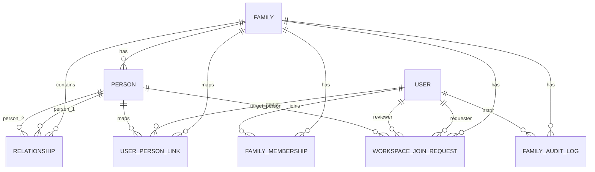

# Kutumbsy Database Schema

This project uses **PostgreSQL + Prisma**.  
Primary schema source of truth: `api-node/prisma/schema.prisma`.

## Family Space Core ERD



## Core Tables

### `families`
- `id` UUID PK
- `name`, `slug` (unique)
- `family_code` (7-char unique code, generated in DB)
- family metadata: description, native_place, created_by_phone
- timestamps: `created_at`, `updated_at`

### `users`
- `id` UUID PK
- `mobile_number` (unique, OTP login identity)
- `password_hash` (nullable, legacy/compat path)
- `full_name`, `status`, `phone_verified_at`
- timestamps

### `family_memberships`
- `id` UUID PK
- `family_id` FK -> `families.id`
- `user_id` FK -> `users.id`
- `role` (admin/editor/viewer etc.)
- `status` (active/inactive)
- unique: (`family_id`, `user_id`)

### `people`
- `id` UUID PK
- `family_id` FK -> `families.id`
- person profile fields: name, gender, dob, deceased flag
- Indian family context fields: native_village, gotra, kuldevta, community
- extensible: `metadata` JSON
- timestamps

### `relationships`
- `id` UUID PK
- `family_id` FK -> `families.id`
- `person_1_id` FK -> `people.id`
- `person_2_id` FK -> `people.id`
- `relationship_type`, `status`
- lifecycle dates: `start_date`, `end_date`
- `notes`, `metadata`, timestamps

### `user_person_links`
- `id` UUID PK
- `user_id` FK -> `users.id`
- `family_id` FK -> `families.id`
- `person_id` FK -> `people.id`
- unique: (`family_id`, `user_id`)
- maps login identity to a person profile inside a family

### `workspace_join_requests`
- `id` UUID PK
- `family_id` FK -> `families.id`
- `requesting_user_id` FK -> `users.id`
- `target_person_id` FK -> `people.id` (nullable)
- review fields: `status`, `message`, `reviewed_by_user_id`, `reviewed_at`
- requested access: `requested_role`
- timestamps

### `family_audit_logs`
- `id` UUID PK
- `family_id` FK -> `families.id`
- `actor_user_id` FK -> `users.id` (nullable)
- `action`, `entity_type`, `entity_id`
- `metadata` JSON + timestamp

## Platform Support Tables

The same DB also contains platform/admin tables used by management modules:
- `tenants`
- `plans`
- `tenant_subscriptions`
- `leads`
- `platform_role_templates`
- `faq_articles`
- `system_settings`

## Migration Source

Prisma migration files are in:
- `api-node/prisma/migrations/*`

Apply migrations:

```powershell
cd D:\Kutumbsy\api-node
npm.cmd run migrate -- --name <change_name>
```

